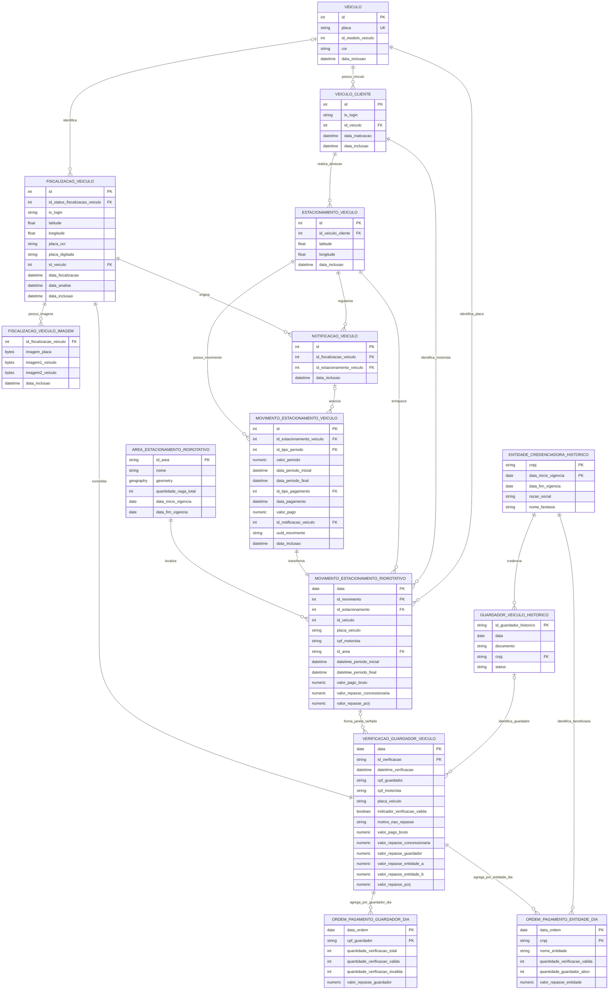

# Modelo relacional do Rio Rotativo para Miro

O bloco Mermaid abaixo pode ser colado no aplicativo **Diagramas Mermaid** de
um board da Miro. Depois da pré-visualização, use **Adicionar ao board**.



## Rateio financeiro da verificação válida

```text
Concessionária Jaé = valor bruto × 4,2%
Guardador          = R$ 1,40
Entidade A         = R$ 0,11
Entidade B         = R$ 0,11
PCRJ               = valor bruto - Jaé - R$ 1,40 - R$ 0,11 - R$ 0,11
```

Os valores de guardador e entidades só são descontados quando a verificação
é válida.

Os períodos pagos contínuos são divididos em subperíodos de duas horas e
R$ 2,00. A primeira fiscalização de cada subperíodo pode gerar repasse; as
seguintes são ocorrências duplicadas. `data_inclusao` da imagem é usada como
proxy do momento da fotografia.

## Motivos oficiais de não repasse

- `VAGA_FORA_VIGENCIA`
- `VAGA_FORA_FUNCIONAMENTO`
- `AUSENCIA_PERIODO_TARIFADO`
- `OCORRENCIA_DUPLICADA`
- `FOTOGRAFIA_POSTERIOR_PRIMEIRA_VALIDACAO`

Somente um motivo é mantido, na ordem apresentada acima.

DDL source_jae:
CREATE TABLE public.fiscalizacao_veiculo ( id serial4 NOT NULL, id_status_fiscalizacao_veiculo int2 NOT NULL, tx_login varchar(128) NOT NULL, latitude float8 NOT NULL, longitude float8 NOT NULL, placa_ocr varchar(10) NOT NULL, placa_digitada varchar(10) NULL, id_veiculo int4 NULL, data_fiscalizacao timestamp NOT NULL, data_analise timestamp NULL, data_inclusao timestamp DEFAULT CURRENT_TIMESTAMP NOT NULL, CONSTRAINT fiscalizacao_veiculo_pkey PRIMARY KEY (id), CONSTRAINT fkfiscalizac225649 FOREIGN KEY (id_veiculo) REFERENCES public.veiculo(id), CONSTRAINT fkfiscalizac245140 FOREIGN KEY (id_status_fiscalizacao_veiculo) REFERENCES public.status_fiscalizacao_veiculo(id) );

CREATE TABLE public.veiculo ( id serial4 NOT NULL, placa varchar(10) NOT NULL, id_modelo_veiculo int2 NOT NULL, cor varchar(40) NULL, data_inclusao timestamp DEFAULT CURRENT_TIMESTAMP NOT NULL, CONSTRAINT veiculo_pkey PRIMARY KEY (id), CONSTRAINT veiculo_placa_key UNIQUE (placa), CONSTRAINT fkveiculo321299 FOREIGN KEY (id_modelo_veiculo) REFERENCES public.modelo_veiculo(id) );

CREATE TABLE public.veiculo_cliente ( id serial4 NOT NULL, tx_login varchar(128) NOT NULL, id_veiculo int4 NOT NULL, data_inativacao timestamp NULL, data_inclusao timestamp DEFAULT CURRENT_TIMESTAMP NOT NULL, CONSTRAINT veiculo_cliente_pkey PRIMARY KEY (id), CONSTRAINT fkveiculo_cl734880 FOREIGN KEY (id_veiculo) REFERENCES public.veiculo(id) );

CREATE TABLE public.estacionamento_veiculo ( id bigserial NOT NULL, id_veiculo_cliente int4 NOT NULL, latitude float8 NOT NULL, longitude float8 NOT NULL, data_inclusao timestamp DEFAULT CURRENT_TIMESTAMP NOT NULL, CONSTRAINT estacionamento_veiculo_pkey PRIMARY KEY (id), CONSTRAINT fkestacionam268328 FOREIGN KEY (id_veiculo_cliente) REFERENCES public.veiculo_cliente(id) );

CREATE TABLE public.movimento_estacionamento_veiculo ( id bigserial NOT NULL, id_estacionamento_veiculo int8 NOT NULL, id_tipo_periodo int2 NOT NULL, valor_periodo numeric(10, 2) NOT NULL, data_periodo_inicial timestamp NOT NULL, data_periodo_final timestamp NULL, id_tipo_pagamento int2 NOT NULL, data_pagamento timestamp NOT NULL, valor_pago numeric(10, 2) NOT NULL, id_notificacao_veiculo int4 NULL, uuid_movimento_estacionamento_veiculo uuid DEFAULT uuid_generate_v4() NOT NULL, data_inclusao timestamp DEFAULT CURRENT_TIMESTAMP NOT NULL, CONSTRAINT movimento_estacionamento_veiculo_pkey PRIMARY KEY (id), CONSTRAINT fkmovimento_566591 FOREIGN KEY (id_tipo_pagamento) REFERENCES public.tipo_pagamento(id), CONSTRAINT fkmovimento_648492 FOREIGN KEY (id_tipo_periodo) REFERENCES public.tipo_periodo(id), CONSTRAINT fkmovimento_796459 FOREIGN KEY (id_estacionamento_veiculo) REFERENCES public.estacionamento_veiculo(id), CONSTRAINT fkmovimento_97658 FOREIGN KEY (id_notificacao_veiculo) REFERENCES public.notificacao_veiculo(id) );

CREATE TABLE public.notificacao_veiculo (
	id serial4 NOT NULL,
	id_fiscalizacao_veiculo int4 NOT NULL,
	id_estacionamento_veiculo int8 NULL,
	data_inclusao timestamp DEFAULT CURRENT_TIMESTAMP NOT NULL,
	CONSTRAINT notificacao_veiculo_pkey PRIMARY KEY (id)
);
-- public.notificacao_veiculo foreign keys
ALTER TABLE public.notificacao_veiculo ADD CONSTRAINT fknotificaca773114 FOREIGN KEY (id_fiscalizacao_veiculo) REFERENCES public.fiscalizacao_veiculo(id);
ALTER TABLE public.notificacao_veiculo ADD CONSTRAINT fknotificaca842191 FOREIGN KEY (id_estacionamento_veiculo) REFERENCES public.estacionamento_veiculo(id);

CREATE TABLE public.fiscalizacao_veiculo_imagem (
	id_fiscalizacao_veiculo int4 NOT NULL,
	imagem_placa bytea NOT NULL,
	imagem1_veiculo bytea NOT NULL,
	imagem2_veiculo bytea NOT NULL,
	data_inclusao timestamp DEFAULT CURRENT_TIMESTAMP NOT NULL,
	CONSTRAINT fiscalizacao_veiculo_imagem_pkey PRIMARY KEY (id_fiscalizacao_veiculo)
);
-- public.fiscalizacao_veiculo_imagem foreign keys
ALTER TABLE public.fiscalizacao_veiculo_imagem ADD CONSTRAINT fkfiscalizac626786 FOREIGN KEY (id_fiscalizacao_veiculo) REFERENCES public.fiscalizacao_veiculo(id);